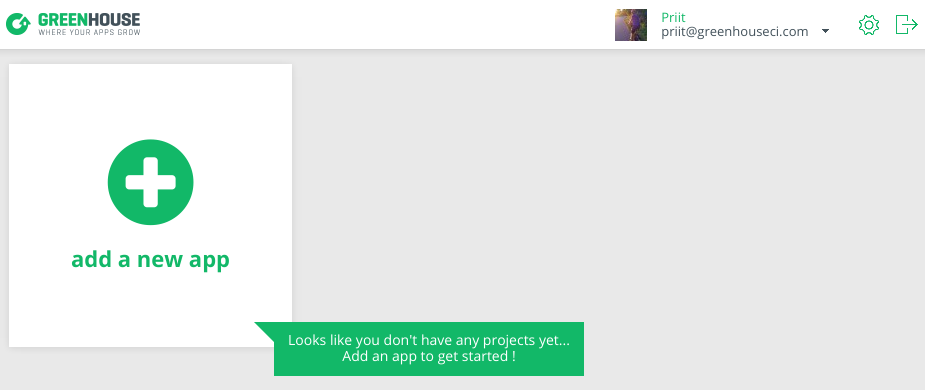
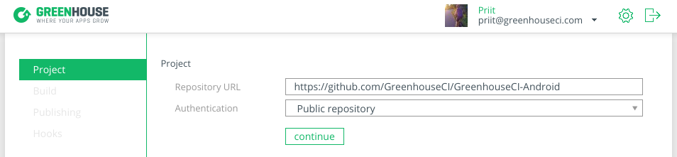
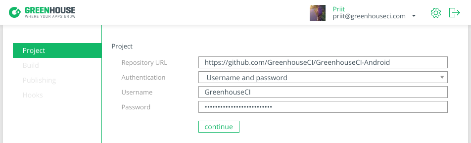
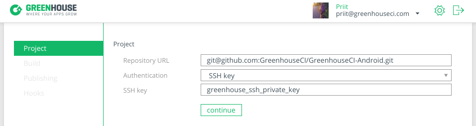
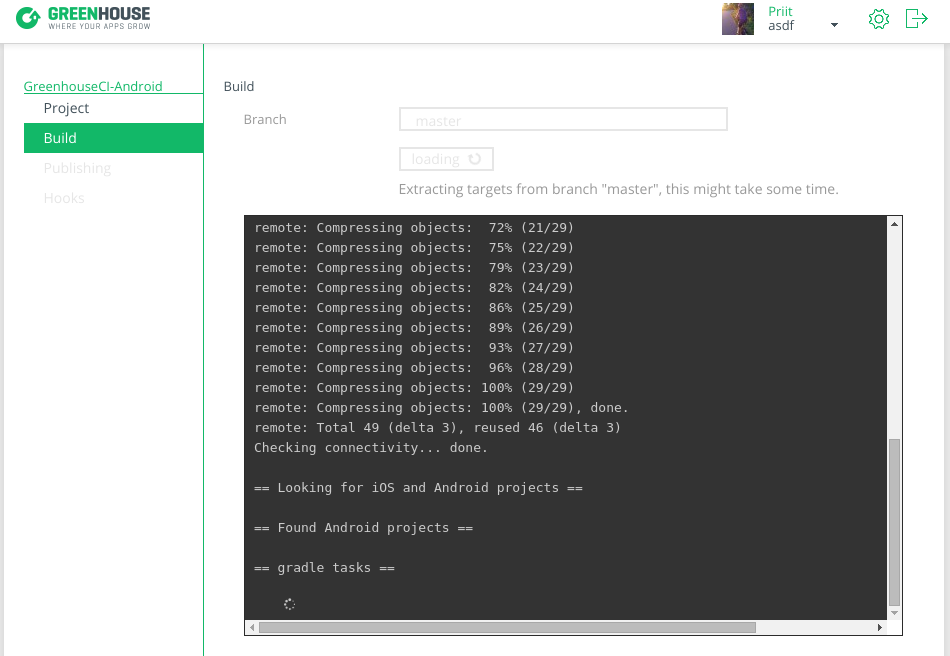

# Building Android apps with Greenhouse #

## What This Guide Covers ##

In this tutorial we give a detailed instructions for Android project setup in
[Greenhouse](https://app.greenhouseci.com).
To be more percise, in what follows, you'll see how to
* [add your app's repository](#specify-git-repository),
* [specify build configuration](#select-configuration),
* setup Git hook,
* get your tests up and running,
* publish your build artefacts to HockeyApp.

## First steps ##

All you need to setup your project in [Greenhouse](https://app.greenhouseci.com) is a web browser.
But as you are already reading this, then I guess we can agree, that you have one anyway.
[Greenhouse](https://app.greenhouseci.com) doesn't require any kind of additional software
fro your side and you event don't have to write any tedious configuration files full of technical
boilerplate. We'll scan your repository and from what you have there our builders finds
everything they need. You'll just have to confirm what configuration you want to build.

But let's get our hand dirty and see how the process works in detail.

The first time you log in to [Greenhouse](https://app.greenhouseci.com) webpage you'll be
presented with an empty dashboard that encourages you to "Add an app to get started!"
Let's get going by clicking on the "add new app".


## Specify Git repository ##

Clicking the "add new app" card on the dashboard will open a new project creation flow that asks
for your **Git repository URL** and **authentication type** for the reposioty.

In the example below, I have entered our dummy Android app's [GitHub](https://github.com)
repo URL and selected public authentication:


For authentication you have three options:
 * [public repository](#public-authentication),
 * [username and password](#username-and-password-authentication),
 * [SSH key](#ssh-key-authentication).

### Public authentication ###

If you have a public repository stored in [**GitHub**](https://github.com),
[**Bitbucket**](https://bitbucket.org/) or any other Git server, you should select
**Public repository** for the authentication type.
Please note, however, that you have to use `http(s)://` URL for the repository.

So, for [**GitHub**](https://github.com) users, the repo URL should be in the form
```text
https://github.com/username/repository-name.git
```
and for [**Bitbucket**](https://bitbucket.org/) users, the repo URL should look like
```text
https://user@bitbucket.org/username/repository-name.git
```

If you have filled in the repository field, hit the green "continue" button and you will be
directed to the [select configuration](#select-configuration) part.

### Username and password authentication ###

In case you have a **password protected repository**, or in other words you are using
*basic auth* to protect your repo, you should select **Username and password**
for the authentication type. When done so, two more inputs are displayed so that you could fill
in your credentials.

As with public repos, we expect you to enter your repository URL in `http(s)://` format, otherwise
you might see a warning that asks you to do so anyway. In conclusion,
if your repository is in [**GitHub**](https://github.com), the repo URL should be in the form
```text
https://github.com/username/repository-name.git
```
and for [**Bitbucket**](https://bitbucket.org/) users, the repo URL should look like
```text
https://user@bitbucket.org/username/repository-name.git
```
All others just make sure your URL starts with a `http(s)://` prefix.

After you have filled in the repository and credentials inputs, you can hit the
green "continue" button and you will be directed to the
[select configuration](#select-configuration) part.



### SSH key authentication ###

Your repository is protected by SSH key? No worries, just select **SSH Key** from the
authentication dropdown. You will be displayed an input where you could *drag-n-drop* your
`SSH private key` or click on it and pick the key in more conventional way.
At very the moment you select/drop the key, we will peek into it and check if it's
password protected. When we discover that the key is indeed protected, we kindly ask you to
write the passphrase to the input field that appears under the SSH key field.

You might expect that as we have emphasized `SSH` so much, the `http(s)://` URLs
won't do the trick any more. And that's true. With SSH key auth you have to use
`ssh://` prefixed URL and none other than you can provide it.

In general the given URL should be something of the form
```
ssh://username@example.com/path/to/repo
```
However, the exact pattern might vary from one hosting service to another.

For example, [**GitHub**](https://github.com) users have to use URL that has the following
pattern:
```text
git@github.com:username/repo-name.git
```
and for [**Bitbucket**](https://bitbucket.org/) users the repo URL should look like
```text
git@bitbucket.org:username/repo-name.git
```

After you have filled in the repository field and have selected SSH private key, you can
hit the green "continue" button and you will be directed to the
[select configuration](#select-configuration) part.



## Select configuration ##

As soon as user submits a repository, either public or private, Greenhouse takes a first look
of it by listing the `branches` in this repository.
The next step for you is to **select the branch** you want Greenhouse to scan for projects from.
To do this you just have to select one branch from the dropdown. If you're confident in your
choice, hit the green "select branch" button.

Clicking on the "select branch" makes send out a request to our builder to start scanning the
specified repository from this branch. This includes cloning the repository, looking for projects
from it and searching for the configurations.

All these actions can be monitored at the same time from your browser via the live log window
as seen below.

